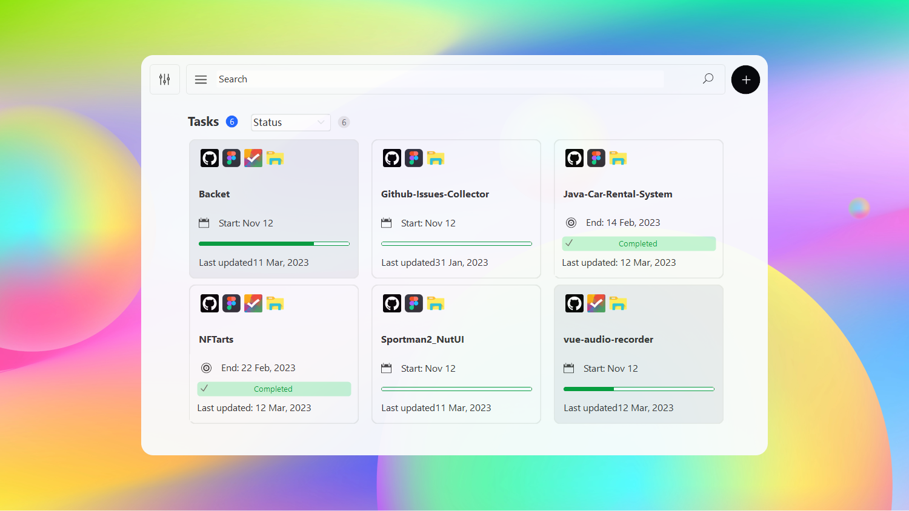
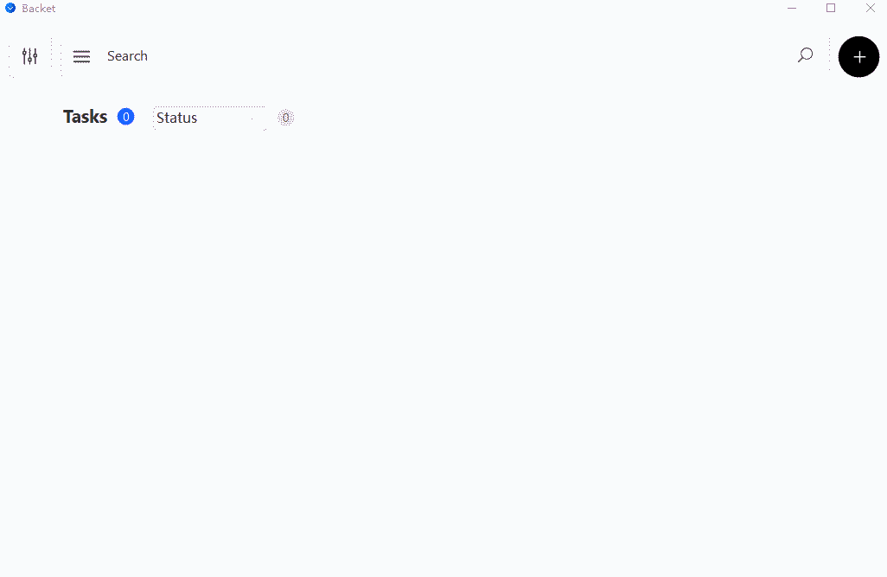
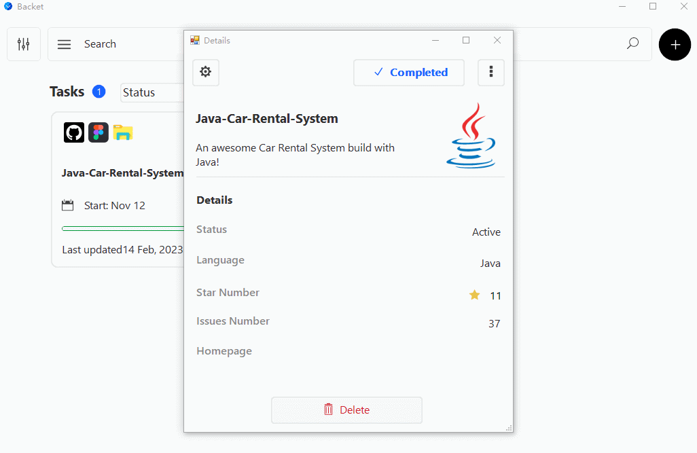
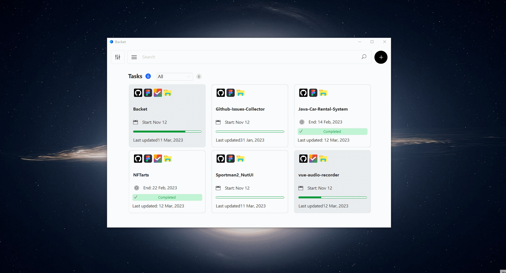
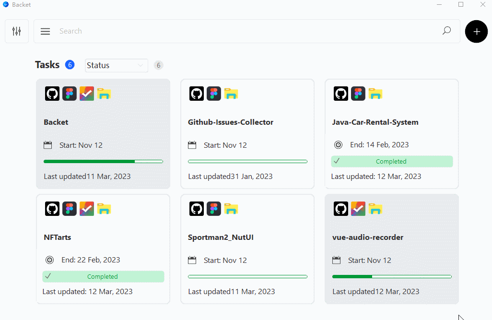

# Backet

``

> Streamline your programming projects with our all-in-one app, designed to efficiently manage all of your ongoing projects in one convenient location.

## 💻 Prerequisites

Before you begin, make sure that you have met the following requirements:

* You have installed [.NET Framework](https://dotnet.microsoft.com/en-us/download/dotnet-framework)

## 🚀 Installing

To install this project, follow these steps:

1. Download installer ： https://github.com/yuenci/Backet/releases
2. Run the installer and complete the installation.

## ☕ Usecase

To use this project, follow these steps:

### 1. Add project

### 2. Check project

### 3. Open the project's resources

### 4. Search projects

### 5. Filter projects

### 6. Delete Project

## 📫 Contributing

To contribute this project, follow these steps:

1. Fork this repository.
2. Crie um branch: `git checkout -b <some_branch>`
3. Make your changes and confirm them: `git commit -m <message_commit>`
4. Push to the original branch: `git push origin <peoject_name> / <local>`
5. Create the pull request.

Alternatively, see the GitHub documentation on how to [create a pull request](https://help.github.com/en/github/collaborating-with-issues-and-pull-requests/creating-a-pull-request).

## 🤝 Collaborations

Innis - [EnjoyCode.me](https://www.enjoycoding.me/) - yuenci1575270674@gmail.com

## 😄 Be one of the contributors

Want to be part of this project? Click HERE and read how to contribute.

## 📝 License

This project is under license. See the [LICENSE](./LICENSE) file for more details.

(<a href="#readme-top">⬆ Back to top</a>)

